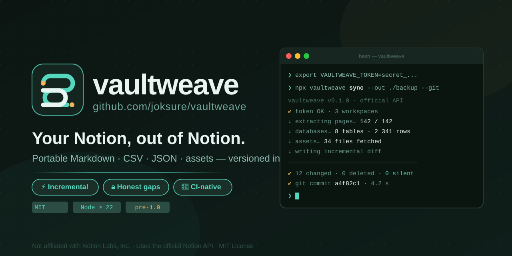
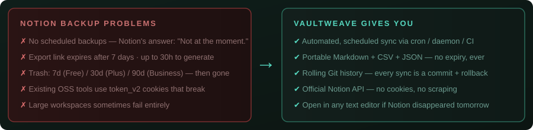
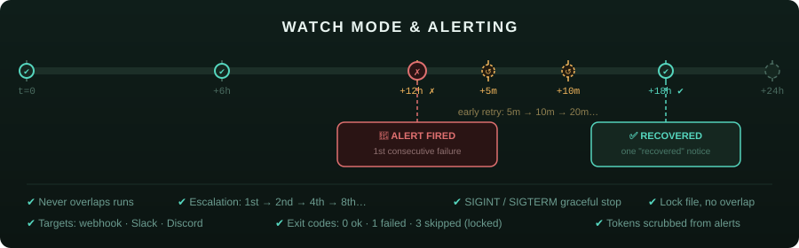
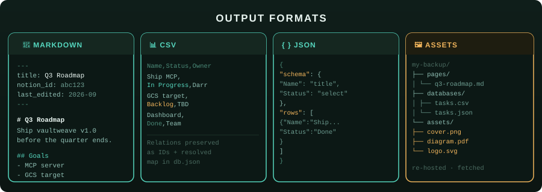
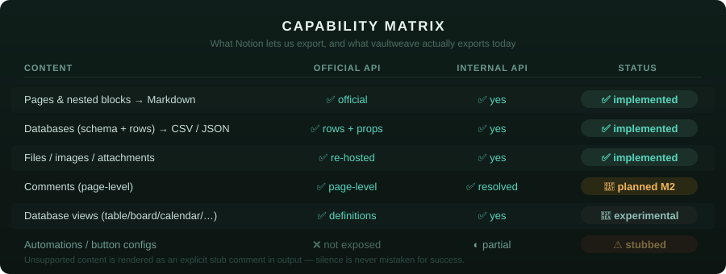
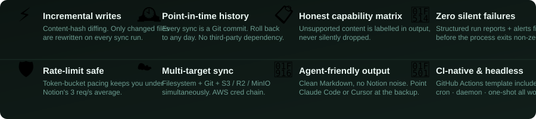
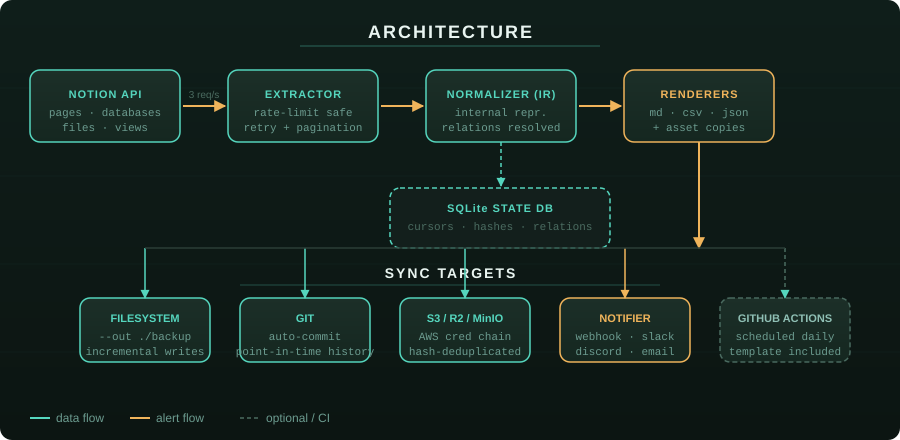

<p align="center">
  
</p>

# vaultweave

**Your Notion, out of Notion.**

Open-source CLI that turns your Notion workspace into portable, versioned,
human-readable files — Markdown, CSV, JSON, and your attachments — written
incrementally into a folder and, optionally, a Git repository or S3 bucket.

[](https://github.com/joksure/vaultweave/actions)
[](LICENSE)
[](CAPABILITIES.md)

---

> **⚠️ Status: early development (M4 — operations layer).** The `1.0.0` version
> number comes from release automation and does **not** mean the CLI or config
> format is stable: flags and config keys may still change.
>
> **Working today:** `sync` (Markdown / CSV / JSON output, hash-based change
> detection, Git history, deletion tombstones, optional S3 target), `watch`
> (daemon), failure alerts (webhook / Slack / Discord), `doctor`, `capabilities`,
> and the experimental `extract` command. See [docs/operations.md](docs/operations.md).
>
> **Known gaps, stated plainly:**
>
> - `backup` and `verify` are not implemented (exit code 2).
> - Every sync still re-reads the whole workspace from Notion; only _writing_ is
>   incremental. A run costs the same number of API requests as a full one.
> - `ignore:` and `redact:` are accepted in the config but **not applied yet** —
>   do not rely on them to keep data out of your backup.
> - Not yet published to npm or Homebrew, and no release binaries yet. Until then,
>   [build from source](#install).
>
> The live status of every capability is tracked in [CAPABILITIES.md](CAPABILITIES.md).

---

## Why this exists



Notion is where your team thinks. But getting your data _out_ — reliably,
automatically, in a format that survives anything — is harder than it should be:

- **No scheduled backups.** Notion's own docs answer "Is there a way to schedule
  automatic backups?" with _"Not at the moment."_
- **Manual export only.** The export link arrives by email, **expires after 7
  days**, can take up to 30 hours to generate, and large workspaces sometimes
  fail entirely.
- **Retention is plan-gated.** Trash lives 7 days (Free) / 30 (Plus) / 90
  (Business). After that, deletion is unrecoverable — not by you, not by
  Notion support, not by any tool.
- **Existing OSS backup tools** scrape a browser cookie (`token_v2`) that
  expires, breaks, and is unsupported.

`vaultweave` aims to give you a backup that is **rolling, automated, honest about
what it can capture, and stored in formats that will outlive any single app.** If
Notion disappeared tomorrow, your `main` branch would still open in any text
editor — and be directly readable by AI coding agents.

## Quickstart

Not on npm yet, so build from source first (see [Install](#install)); the
`vaultweave` command below is what `npm link` gives you. Once the package is
published, `npx vaultweave <command>` will work the same way.

```bash
export VAULTWEAVE_TOKEN=secret_...            # prefer the env var over --token

# one-shot sync into a folder
vaultweave sync --out ./my-notion

# …and commit every run to a git repo inside that folder
vaultweave sync --out ./my-notion --git

# daemon: sync every 6 hours, alert Slack when a run fails
vaultweave watch --interval 6h --out ./my-notion --git \
  --notify slack:https://hooks.slack.com/services/...
```

Or run it fully managed in GitHub Actions — see
[`templates/github-workflow.yml`](templates/github-workflow.yml) for a scheduled
daily backup (secrets: `VAULTWEAVE_TOKEN`, optional `VAULTWEAVE_ALERT`).

## Running unattended



A backup nobody notices failing is worse than no backup. `vaultweave` is built so
failure is loud:

- **Exit codes:** `0` ok · `1` failed or incomplete · `3` skipped because another
  run holds the lock.
- **Alerts:** `--notify` (repeatable) or `notify.on_error` in the config. Targets:
  `webhook:<url>` (JSON), `slack:<url>`, `discord:<url>`. Alerts fire on the 1st
  consecutive failure, then the 2nd, 4th, 8th…, and one _recovered_ notice
  follows the next success. Alert text contains counts and error codes — never
  page content — and webhook URLs and tokens are scrubbed from every message and
  log line.
- **`watch`:** never overlaps runs, retries early after a failure (5m, 10m, 20m…
  up to the interval), and stops gracefully on SIGINT/SIGTERM.
- **`doctor`:** flags a stale backup, a failed last run, missing `git`, stuck
  downloads and — with `--deep` — backed-up pages Notion no longer shows to the
  integration.

Details, payload schema and a systemd unit: [docs/operations.md](docs/operations.md).

## Output formats



## Targets

`vaultweave sync` always writes to the local filesystem (`out:`) and can
optionally write to additional targets. Git is enabled with `git: true` or
`--git`. S3-compatible storage is configured with the AWS credential chain
(environment, shared AWS config, or instance role):

```yaml
targets:
  s3:
    bucket: my-notion-backup
    prefix: notion/
    region: ap-southeast-1
    # endpoint: https://...       # R2, MinIO, or another S3-compatible service
    # forcePathStyle: true         # commonly needed by MinIO
```

The equivalent CLI options are `--s3-bucket`, `--s3-prefix`, `--s3-region`,
`--s3-endpoint`, and `--s3-force-path-style`. S3 is an optional dependency;
installs that do not use an S3 target do not load the AWS SDK. Each object is
compared by content hash, then uploaded through a temporary key and copied to its
final key. Files are handled independently, so one upload error is reported
without stopping the other files.

## What gets backed up



✅ = written by `sync` today · 🧪 = extracted by the experimental `extract` command, not exported yet · 🚧 = planned · ⚠️ = limited by the Notion API

| Images / files / attachments | `assets/` (re-hosted copies) | ✅ |
| Comments | `page.comments.md` | 🚧 planned |
| Database views (table/board/calendar/…) | view definitions as JSON (`db.views.json`) | 🧪 extracted only; export planned |
| Images / files / attachments | `assets/` (re-hosted copies) | 🚧 <!-- VERIFY against CAPABILITIES.md --> |
| Comments | `page.comments.md` | 🚧 <!-- VERIFY against CAPABILITIES.md --> |
| Database views (table/board/calendar/…) | view definitions as JSON (`db.views.json`) | 🚧 <!-- VERIFY against CAPABILITIES.md --> |
| Automations, button configs | stub comment in output | ⚠️ API limit |

We never claim "full backup". The complete, machine-checked matrix lives in
[CAPABILITIES.md](CAPABILITIES.md), and anything not exported is marked
**explicitly** in your output — silence is never mistaken for success.

## Features



- **Incremental writes** — content-hash diffing avoids rewriting unchanged files;
  each run still reads the whole workspace from Notion.
- **Rate-limit safe** — token-bucket pacing under Notion's 3 req/s average.
- **Point-in-time history** — with `--git`, every sync is a Git commit; roll back
  to any day.
- **Zero silent failures** — structured run reports; failures alert your
  webhook/Slack/Discord _before_ the process exits non-zero.
- **Honest** — unsupported content is labelled, not dropped quietly.
- **Agent-friendly output** — clean Markdown, no internal Notion noise; point
  Claude Code or Cursor at your backup repo and ask questions about your own notes.
- **CI-native** — first-class GitHub Actions template; headless by design.

## How it works



```
Notion API ──▶ Extractor ──▶ Normalizer (IR) ──▶ Renderers (md/csv/json)
                                              │
                              SQLite state (cursors · hashes · relations)
                                              │
                                     Sync targets: fs · git · cloud
                                              │
                                   Run report ──▶ Notifier ──▶ you
```

`vaultweave sync` is resumable, idempotent, and safe to run from cron, a daemon,
or CI.

## Configuration

Minimal `.vaultweave.yaml`:

```yaml
token: ${VAULTWEAVE_TOKEN} # env expansion supported
out: ./vaultweave-backup
git: true # auto-commit per run
interval: 6h # used by `vaultweave watch` (minimum 1m)
notify:
  on_error: slack:${SLACK_WEBHOOK} # one target, or a list of targets
  on_success: silent
# `ignore:` and `redact:` are accepted but NOT APPLIED YET — see Security.
```

Run `vaultweave doctor` to check the token (reachability and content access), the
freshness of your last backup, git readiness and stuck downloads; add `--deep` to
also detect backed-up pages that are no longer reachable.

## Security

- Token comes from env/secret stores only — **never** written into the synced repo.
- **Output redaction is not available yet.** The `redact:` and `ignore:` config
  keys are accepted but not applied, so treat your backup as containing
  everything the integration can see.
- An internal-API fast path exists for power users, but requires an explicit
  risk acknowledgement; the official-API path is the default and fully supported.
- See [docs/security.md](docs/security.md).

## Install

**From source (works today):**

```bash
git clone https://github.com/joksure/vaultweave.git
cd vaultweave
nvm use            # Node 22+ (see .nvmrc)
npm ci
npm run build
npm link           # exposes the `vaultweave` command
```

**Planned, not published yet:**

- `npm i -g vaultweave` (or `bun add -g vaultweave`)
- `brew install joksure/tap/vaultweave` (macOS)
- Standalone binaries (Linux/macOS/Windows) attached to releases

## Roadmap

- [x] Scaffolding, CI, CLI skeleton, `doctor`, config, rate limiter (M0)
- [x] Official-API extractor: block trees, databases, views, files, pacing and retry (M1) — experimental `extract`
- [x] Markdown/CSV/JSON renderers and filesystem target (M2)
- [x] State DB, hash-based change detection, Git history, tombstones, incremental writes (M3)
- [x] Watch mode, notifiers, lock, run reports, extended `doctor`, Actions template (M4)
- [x] S3/S3-compatible cloud target (AWS credential chain, optional dependency)
- [ ] True incremental extraction (skip unchanged pages instead of re-reading the workspace)
- [ ] Apply `ignore:` and `redact:` to output
- [ ] `backup` and `verify` commands
- [ ] First npm / Homebrew publish and release binaries
- [ ] GCS / Google Drive cloud targets (plugin packages)
- [ ] Read-only local MCP server over your synced repo
- [ ] Team dashboard (sync health across workspaces)

## Development

```bash
nvm use            # Node 22+ (see .nvmrc)
npm ci
npm run lint       # biome (warnings are errors)
npm run typecheck
npm test           # vitest, fully offline
npm run build
npm run capabilities:check   # CAPABILITIES.md must match src/core/capabilities.ts
```

The full design lives in [docs/architecture.md](docs/architecture.md).

## Contributing

Contributions welcome — especially new renderers, notifier plugins, and recorded
API fixtures for golden tests. Please run `npm test` and include a golden fixture
for any extraction change. See [CONTRIBUTING.md](CONTRIBUTING.md).

## Disclaimer

Not affiliated with, endorsed by, or sponsored by Notion Labs, Inc. "Notion" is
a trademark of Notion Labs, Inc. This tool uses the official Notion API.

## License

MIT — see [LICENSE](LICENSE).
